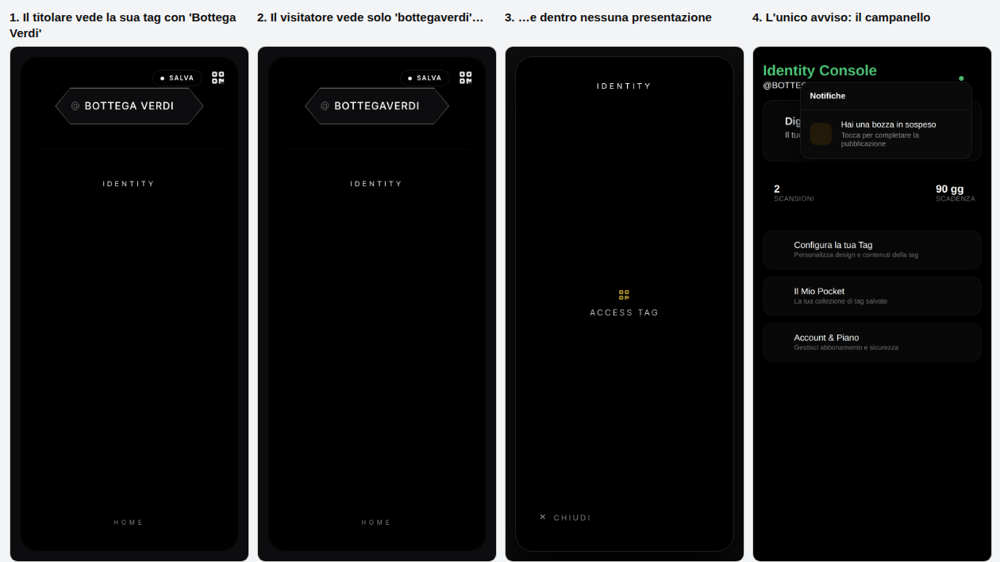
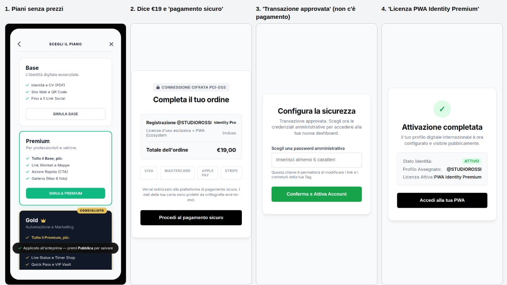
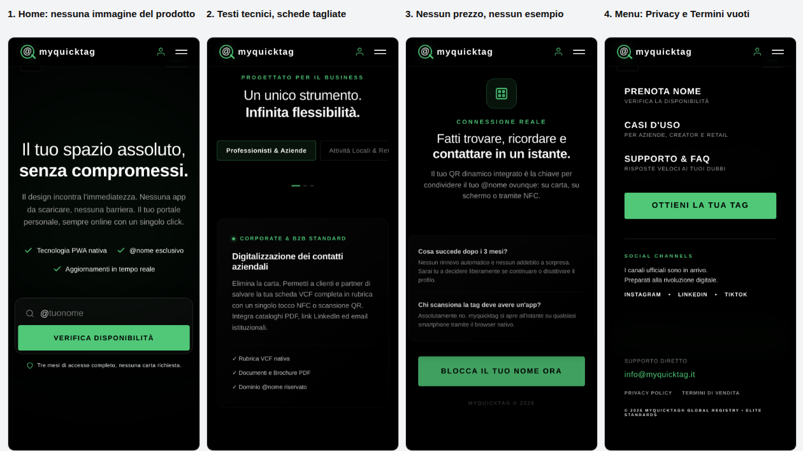
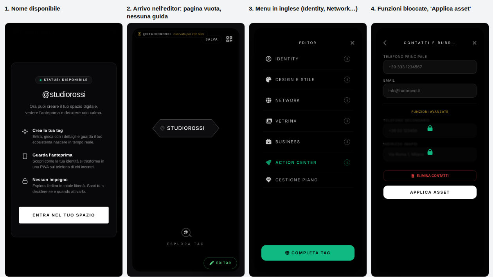
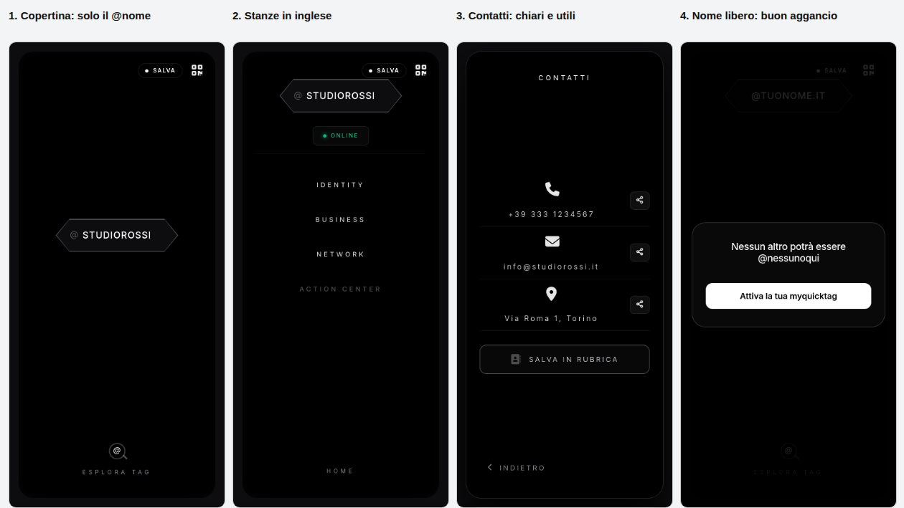
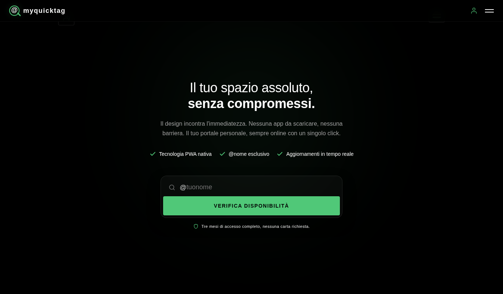

# Audit di UI, UX e marketing — myquicktag

Fatto il 04/10/2026 sul ramo `sviluppo-v2` (stesso codice del sito pubblico più le ultime modifiche).
Le schermate sono nella cartella `audit/` (esclusa dal sito pubblico).

**Come è stato fatto.** Dalla sessione cloud il sito vero non si raggiunge, quindi ho acceso una copia
del sito con un finto database e l'ho percorsa con un telefono simulato (schermo di un iPhone, 390 px)
come farebbe un cliente nuovo: home → verifica del nome → editor → attivazione → tag pubblica vista da
un altro telefono → dashboard. In più: controllo automatico di accessibilità e lettura di tutti i testi.

---

## In breve

Il prodotto c'è e la parte "tecnica" (nomi, sicurezza, contatti del vasetto) è solida. I problemi sono
nel **racconto** e nel **primo percorso del cliente**:

1. **Un errore grave**: i contenuti scritti nell'editor prima dell'attivazione **non diventano pubblici**.
   Il cliente vede la sua tag completa, i visitatori vedono una tag vuota.
2. **Il checkout racconta un pagamento che non c'è** (€19,00, "pagamento sicuro", loghi Visa/Mastercard,
   "Transazione approvata"), mentre l'attivazione è gratuita.
3. **Mancano le basi legali**: Privacy e Termini sono link vuoti, ma il sito raccoglie dati di persone
   (contatti lasciati nel vasetto, città dei visitatori).
4. **Chi dimentica la password perde la tag**: non chiediamo l'email e non c'è il recupero.
5. **La home non fa vedere cosa si compra**: nessun esempio di tag, nessuna immagine, nessun prezzo,
   tono "di lusso" e molte parole inglesi o tecniche (PWA, VCF, Asset, Identity Console…).

---

## Priorità 1 — da sistemare prima del lancio

### 1.1 I contenuti dell'editor non vengono pubblicati all'attivazione (errore) — ✅ corretto il 06/10/2026

- **Cosa succede.** Il cliente nuovo scrive nome, presentazione, contatti e preme "Completa tag".
  Il lavoro viene salvato come **bozza privata**; l'attivazione nel checkout imposta solo password e stato.
  Dopo l'attivazione il cliente apre la sua tag e la vede completa (sul suo telefono la bozza viene
  mostrata), ma **chi la apre da un altro telefono vede solo il @nome**.
- L'unico segnale è nel campanello della dashboard ("Hai una bozza in sospeso"). Il pulsante
  "Pubblica la tua tag" compare solo aprendo l'anteprima dalla dashboard.
- **Corretto (06/10/2026):** all'attivazione il server (`api/update-profile.js`) copia la bozza nella tag
  pubblica e la svuota. Corretti anche due errori trovati nelle prove:
  - la pulizia di sicurezza rovinava gli elenchi dentro la bozza (telefono/indirizzo, social, partner,
    galleria), rendendoli illeggibili anche col tasto "Pubblica" della dashboard (`lib/pulizia.js`);
  - una tag con il solo telefono non mostrava la stanza NETWORK, quindi il telefono era irraggiungibile
    (`tag-logic.js`).
- Da controllare sul sito vero: le tag di prova attivate finora potrebbero essere "vuote" per i visitatori.

### 1.2 Checkout: prezzo e pagamento che non esistono

> **Nota del titolare (05/10/2026): scelta voluta.** Il checkout con pagamento simulato è il segnaposto del
> futuro pagamento con Stripe (vedi "Scelte volute" in `PASSAGGIO-CONSEGNE.md`). Non va corretto ora.

- Mostra **"Totale €19,00"**, "Connessione cifrata **PCI-DSS**", loghi **Visa, Mastercard, Apple Pay,
  Stripe**, "Procedi al **pagamento** sicuro", poi "**Transazione approvata**" senza alcun pagamento.
- Per un cliente è spaventoso (pensa di pagare 19 €) e poi sospetto (non gli chiede la carta).
  Indicare certificazioni e circuiti di pagamento non usati è anche un rischio legale
  (pratica commerciale ingannevole).
- I nomi del piano cambiano a ogni schermata: "Identity Pro", "PWA Identity Premium", nella dashboard "Base".
- **Proposta:** finché è gratis, il checkout diventa "**Attiva @nome — gratis per 3 mesi**": riepilogo
  (cosa include, quando scade, cosa succede dopo), scelta password, un solo pulsante "Attiva la mia tag".
  Niente prezzi, loghi o diciture di pagamento. (Già segnalato in `PRE-LANCIO.md`, qui con le schermate.)

### 1.3 Privacy, Termini e "Segnala questa tag"
- Nel menu della home "Privacy Policy" e "Termini di Vendita" sono link vuoti (`href="#"`).
  Non esiste una pagina privacy né un avviso sui cookie/archiviazione nel telefono.
- Il sito raccoglie **dati personali di terzi** (nome e telefono/email lasciati nel vasetto) e la città
  dei visitatori: serve un'informativa privacy (GDPR) per i visitatori e per i titolari, e una riga
  sotto il modulo del vasetto ("I tuoi dati vanno solo a @nome…").
- Termini di servizio con la regola già decisa sui nomi (impersonificazione e marchi) e tasto
  **"Segnala questa tag"** sulla tag pubblica (oggi non c'è).
- Il testo legale andrebbe fatto controllare da un professionista (insieme alla consulenza fiscale già prevista).

### 1.4 Nessuna email del cliente, nessun recupero password
- Al checkout si sceglie solo una password (una casella, senza "ripeti" e senza "mostra"). Nel login
  non c'è "Password dimenticata?". Chi la dimentica, o cambia telefono, **non può più modificare la tag**
  e noi non abbiamo modo di contattarlo (neanche per avvisarlo della scadenza dei 90 giorni).
- **Proposta (decisione di prodotto):** chiedere l'email all'attivazione; più avanti il recupero
  password via email (si può fare gratis entro certi volumi; va scelto il servizio).

### 1.5 La promessa dei "tre mesi di accesso completo" non corrisponde
- La home dice "**Tre mesi di accesso completo**, nessuna carta richiesta", ma dopo l'attivazione il
  piano è **Base**: nell'editor le funzioni avanzate sono bloccate e sfocate.
- Al contrario, sulla tag pubblica alcune funzioni Premium (es. "Azione rapida") **compaiono anche
  ai Base**, perché il codice tratta il piano vuoto come "non Base". Risultato: regole diverse tra editor e tag.
- **Da decidere:** durante i 3 mesi tutto sbloccato (come nella proposta "prova Gold") oppure Base
  con testo della home corretto. Poi allineo editor e tag pubblica alla stessa regola.

### 1.6 Piccoli errori visibili
- Email del supporto: si legge `info@myquicktag.it` ma il link apre `info@myquicktag.com`.
- Anteprima dei link: l'immagine per WhatsApp/Facebook (`/assets/og-image.jpg`) **non esiste**, e la tag
  pubblica non ha titolo né descrizione propri: condividendo `myquicktag.it/u/nome` su WhatsApp
  appare solo "myquicktag", senza nome né foto del titolare. Per un prodotto che vive di condivisione
  è la vetrina gratuita più importante.
- "© 2026 MYQUICKTAG® GLOBAL REGISTRY • ELITE STANDARDS": la ® si può usare solo con marchio
  registrato; "Global Registry" fa pensare a un ente ufficiale. Meglio "© 2026 myquicktag".

---

## Priorità 2 — percorso del cliente e testi

### 2.1 Home: non si capisce cosa si ottiene

- La prima schermata dice "Il tuo spazio assoluto, senza compromessi": bella frase, ma non dice
  **cosa** è myquicktag. Chi arriva non vede **mai una tag di esempio**, una foto di un QR su un bancone,
  un biglietto con l'NFC.
- Ci sono 4 sezioni, ognuna con un titolo astratto ("Potenza illimitata", "Un ecosistema d'élite con un
  singolo click", "Infinita flessibilità") e caselle che si scorrono di lato (sul telefono le schede
  "Professionisti / Attività locali / Creator" sono tagliate).
- Mancano: **come funziona** in 3 passi, **un esempio vero** da aprire, **quanto costa** dopo i 3 mesi
  (anche solo "da decidere, nessun rinnovo automatico" è già nella FAQ), chi c'è dietro.
- Non è chiaro se si vende anche un oggetto fisico (adesivo/portachiavi NFC) o solo il link+QR.
  **Domanda per il titolare.**

**Proposta di struttura (stesso stile scuro):**
1. *Titolo:* "Il tuo biglietto da visita digitale. Un @nome, un QR, tutti i tuoi contatti."
   *Sotto:* "Chi inquadra il tuo QR vede subito come chiamarti, scriverti e trovarti. Nessuna app.
   Gratis per 3 mesi." + campo "@tuonome" + "Verifica".
2. *Un esempio:* immagine di un telefono con una tag compilata + "Guarda un esempio" (una tag demo vera,
   es. `@esempio`).
3. *Come funziona:* 1. Scegli il tuo @nome · 2. Aggiungi contatti, social e foto · 3. Condividi il link o
   stampa il QR.
4. *Per chi è:* le tre schede attuali, come elenco verticale (niente scorrimento laterale).
5. *Domande frequenti* (le due attuali + "Quanto costa dopo?", "Posso cambiare nome?", "I miei dati?").
6. *Piè di pagina:* contatti, Privacy, Termini.

### 2.2 Tono e lingua: troppo "lusso" e troppo inglese
Il sito alterna italiano e inglese e usa parole tecniche che un ristoratore o un idraulico non conosce.
Glossario proposto (da approvare):

| Oggi | Proposta |
|---|---|
| Identity Console | La mia tag / Pannello |
| Identity Portal | Accedi |
| Identity / Network / Business / Vetrina / Action Center (stanze) | Chi sono / Contatti e social / Clienti / Vetrina / In evidenza |
| Access Tag | QR code della tag |
| Lead Capture (Vasetto) | Raccogli contatti |
| Scudo Reputazione | Recensioni |
| MQT Flash | Offerta del giorno |
| Live Status | Aperto/chiuso ora |
| Quick Pass | Porta un amico |
| VIP Vault | Link con PIN |
| Applica asset / Applica bio | Fatto |
| Tecnologia PWA nativa | Si apre su qualsiasi telefono, senza app |
| Rubrica VCF nativa | Salva in rubrica con un tocco |
| Dominio @nome riservato | Il tuo @nome, solo tuo |
| Pocket | Tag salvate |
| Status: Disponibile | Disponibile! |
| Credenziali amministrative / password amministrativa | Password |

Frasi da rivedere: "ecosistema d'élite", "spazio assoluto", "Preparati alla rivoluzione digitale",
"profilo digitale internazionale", "Business Intelligence", "Info strategica", "L'arsenale di conversione".

### 2.3 Prenotazione ed editor: il primo minuto

- Dopo "Entra nel tuo spazio" il cliente atterra su una **pagina nera con solo il suo @nome** e il
  pulsante "Editor" in basso: nessuna indicazione su cosa fare. Il pulsante "Salva" in alto si
  sovrappone all'etichetta del tempo rimasto ("riservato per 23h 59m").
- Per scrivere il nome servono 3 passaggi (Editor → Identity → Nome e avatar). Il menu ha 7 voci in
  inglese con un "i" accanto che apre spiegazioni di marketing.
- Il pulsante principale si chiama "**Completa tag**", ma l'avviso dopo ogni modifica dice "premi
  **Pubblica** per salvare": il cliente cerca un pulsante "Pubblica" che non c'è.
- Le funzioni dei piani superiori appaiono sfocate con un lucchetto, senza dire quale piano serve.
- I messaggi d'errore sono finestre del browser (`alert`, 26 solo nell'editor), poco eleganti.
- **Proposta:** all'arrivo, un riquadro "Inizia da qui" con 3 passi spuntabili (Nome e foto → Telefono
  ed email → Social) che portano direttamente al campo giusto, e un pulsante sempre uguale:
  "Attiva la tag" (prima dell'attivazione) / "Pubblica" (dopo).

### 2.4 Dopo l'attivazione: manca il "e adesso?"
- La conferma dice "Attivazione completata" e poi la tag propone "Installa ora" (aggiungere la tag alla
  schermata Home del titolare).
- Il passo che conta per il cliente è **condividere**: mostrare il suo link `myquicktag.it/u/nome`, il QR
  da scaricare/stampare e "Copia link" / "Condividi su WhatsApp". È anche il nostro miglior marketing
  (ogni tag condivisa porta visitatori sul sito).
- La pagina `celebration.html` esiste ma nessuna pagina ci porta: si può riusare per questo scopo o eliminare.

### 2.5 Tag pubblica: il visitatore deve toccare troppo

- La copertina mostra solo il @nome (in maiuscolo, non il nome scelto dal titolare e senza foto) e
  "Esplora tag". Per telefonare servono 3 tocchi (Esplora → Network → Rubrica & contatti).
- Chi scansiona un QR al bancone vuole subito: **chiamare, WhatsApp, indicazioni, salvare il contatto**.
- **Proposta:** in copertina nome visualizzato + foto + 2–3 pulsanti diretti (quelli che il titolare
  ha compilato), poi "Scopri di più". Le stanze restano per chi vuole approfondire.
- Buono: la pagina dei contatti è chiara, e la pagina di un nome libero ("Nessun altro potrà essere
  @nome — Attiva la tua myquicktag") è un ottimo aggancio commerciale.

### 2.6 Dashboard
- Pulita e comprensibile. Da rivedere solo le parole ("Identity Console", "Digital Identity — Il tuo
  nome nel mondo", "Business Intelligence") e mettere in evidenza l'avviso della bozza non pubblicata
  (oggi è nascosto nel campanello).

---

## Priorità 3 — telefono, accessibilità e rifiniture

- **Icone doppie**: sotto la barra in alto spuntano due vecchi pulsanti (profilo e menu), visibili sia
  da telefono sia da computer. Con il menu aperto la sua "X" resta coperta dalla barra.
- **Zoom bloccato** su home, editor e statistiche: chi vede poco non può ingrandire (requisito di
  accessibilità; il controllo automatico lo segnala).
- **Testi molto piccoli** (8–11 px) e grigio scuro su nero sotto il contrasto minimo (dashboard,
  checkout, piè di pagina della home).
- **Pulsanti non raggiungibili da tastiera/lettore di schermo**: molti "pulsanti" sono riquadri
  cliccabili senza nome (108 nell'editor, 10 nella tag, 7 nella home; nessuna etichetta sulle icone).
- **Checkout bianco** mentre tutto il resto è nero: sembra un altro sito proprio nel momento della fiducia.
- Maiuscole del nome incoerenti nei titoli delle pagine ("MyQuickTag", "myquicktag", "MYQUICKTAG").
- Tecnico: una libreria dell'editor (Sortable) è caricata "nell'ultima versione disponibile": un suo
  aggiornamento potrebbe rompere l'editor senza che cambiamo nulla. Va fissata a una versione.

---

## Cosa funziona bene (da tenere)

- Verifica del nome veloce e chiara; buona gestione di nomi protetti e riservati (popup dorato chiaro).
- La prenotazione con il tempo rimasto visibile crea la giusta urgenza.
- Anteprima della tag dentro l'editor, identica a quella pubblica.
- Pagina contatti della tag e "Salva in rubrica"; pagina "I miei contatti" con istruzioni quando è vuota.
- Stile scuro coerente e riconoscibile (verde smeraldo + nero).

---

## Piano di lavoro proposto

**A. Correzioni (posso procedere subito, spiegando dopo)**
1. ✅ Pubblicazione dei contenuti all'attivazione (1.1) + prova automatica.
2. Email del supporto, icone doppie e "X" del menu, zoom, versione fissa della libreria (1.6, 3).
3. Stessa regola dei piani tra editor e tag pubblica, appena deciso il punto 1.5.

**B. Testi (serve il tuo ok sul tono e sul glossario)**
4. Checkout "gratis per 3 mesi" senza diciture di pagamento (1.2).
5. Glossario italiano in tutto il sito (2.2) e nuova home (2.1).
6. Schermata "e adesso condividi" dopo l'attivazione (2.4).

**C. Decisioni di prodotto (tue)**
7. Email del cliente all'attivazione e recupero password (1.4).
8. Durante i 3 mesi: tutto sbloccato o Base? (1.5)
9. Privacy, Termini e "Segnala questa tag" (1.3).
10. Copertina della tag con pulsanti diretti (2.5) e anteprima dei link su WhatsApp con nome e foto (1.6).

**Domande aperte:** si vende anche un oggetto fisico (adesivo/portachiavi NFC)? Esiste una tag di
esempio da mostrare in home? Chi è il cliente principale da cui partire (attività locali,
professionisti o creator)? La home dovrebbe parlare prima a lui.
